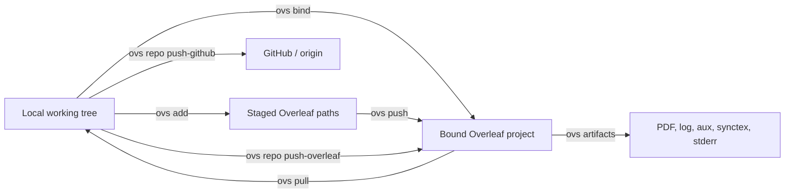

<p align="center">
  <strong>Overleaf Sync</strong><br/>
  Local-first Overleaf workflow for people who also live in Git.
</p>

<p align="center">
  <a href="https://www.python.org/downloads/">
    
  </a>
  <a href="/LICENSE">
    
  </a>
  
</p>

<p align="center">
  <code>bind + push/pull</code> · <code>staged Overleaf updates</code> · <code>remote tree</code> · <code>GitHub + Overleaf repo workflow</code>
</p>

Overleaf Sync is a CLI for working with an existing Overleaf project from a local folder or a local Git repository.

It focuses on three jobs:

- exact folder sync between your working tree and Overleaf
- a git-like bound workflow with `bind`, `add`, `push`, `pull`, `status`
- access to compile outputs beyond `output.pdf`
- a repo workflow where GitHub and Overleaf are driven from one local checkout
- warnings before destructive sync actions and step-by-step progress during sync

## At a Glance



| You want to... | Use this |
| --- | --- |
| bind the current folder once, then push/pull without project flags | `ovs bind --name "Project"` |
| stage selected paths before pushing to Overleaf | `ovs add path/to/file.tex` |
| push staged paths or all bound changes | `ovs push` |
| pull remote changes into the bound folder | `ovs pull` |
| push local files to Overleaf | `ovs -l --name "Project"` |
| pull remote files to local | `ovs -r --name "Project"` |
| preview sync actions first | `ovs --dry-run ...` or `ovs status ...` |
| inspect the real remote file tree | `ovs tree --name "Project"` |
| fetch compile logs and artifacts | `ovs artifacts --name "Project"` |
| manage a Git repo that also syncs to Overleaf | `ovs repo ...` |

## Install

```bash
git clone https://github.com/GaryOAO/overleaf-sync.git
cd overleaf-sync
python -m venv .venv
source .venv/bin/activate
pip install -e .
pip install PySide6
playwright install chromium
```

`PySide6` is only needed for browser login.

You can use either command name:

- short: `ovs`
- full: `overleaf-sync`

## Quick Start

### 1. Log in once

```bash
ovs login
ovs list
```

By default, `ovs login` saves auth once to a global store and later commands reuse it automatically.
If a local `.overleaf-sync-auth` or `.olauth` exists in the current sync folder, that local store is used first.

### 2. Sync a local folder with Overleaf

```bash
# Bind once
ovs bind --name "My Overleaf Project"

# Stage the files you want to send
ovs add sections/intro.tex figures/arch.pdf

# Push staged changes
ovs push

# Pull remote changes later
ovs pull

# Push local files to Overleaf
ovs -l --name "My Overleaf Project"

# Pull remote files to local
ovs -r --name "My Overleaf Project"

# Show the plan without changing anything
ovs --dry-run -l --name "My Overleaf Project"
ovs status -n "My Overleaf Project"
```

### 3. Inspect remote state and compile results

```bash
# Show the remote file tree
ovs tree --name "My Overleaf Project"

# List compile artifacts
ovs artifacts --name "My Overleaf Project"

# Download selected outputs
ovs artifacts --name "My Overleaf Project" \
  --artifact output.log --artifact output.stderr

# Download the compiled PDF
ovs download --name "My Overleaf Project" --download-path output
```

### 4. Add repo workflow on top

Inside an existing Git repository:

```bash
# Create repo-level config
ovs repo init --name "My Overleaf Project"

# Show Git + Overleaf side by side
ovs repo status

# Push committed history to GitHub
ovs repo push-github

# Pull committed history from GitHub
ovs repo pull-github

# Push current working tree to Overleaf
ovs repo push-overleaf

# Pull remote Overleaf state into the working tree
ovs repo pull-overleaf
```

> `ovs repo` is a repo workflow layer built on top of the current sync engine.  
> It is not Overleaf's official Git integration.

## Command Surface

### Core sync

- `ovs bind`
- `ovs add`
- `ovs reset`
- `ovs push`
- `ovs pull`
- `ovs login`
- `ovs list`
- `ovs -l`
- `ovs -r`
- `ovs --dry-run`
- `ovs status`

### Remote inspection

- `ovs tree`
- `ovs artifacts`
- `ovs download`

### Repo workflow

- `ovs repo init`
- `ovs repo status`
- `ovs repo push-github`
- `ovs repo pull-github`
- `ovs repo push-overleaf`
- `ovs repo pull-overleaf`

Backward compatibility note:

- `ovs bridge ...` still works
- `ovs repo ...` is the recommended interface going forward

## Why `repo` Mode Exists

Most Overleaf scripts stop at "upload files". This one does not.

- `bind` writes `.overleaf-sync.json` in the current folder so later `push`, `pull`, `status`, `tree`, `artifacts`, and `download` can infer the Overleaf project automatically.
- `add` writes a small local stage file and records both the local content hash and the remote content hash at staging time.
- `push` can then reject stale stages when the Overleaf side changed after `ovs add`, instead of silently overwriting newer remote edits.
- `pull` refuses to overwrite a folder that still has staged Overleaf updates pending.
- GitHub operations use your existing local Git repository, its configured `origin`, and your local Git credentials.
- Overleaf operations still use the auth store plus the current sync engine.
- `repo init` writes `.overleaf-sync.json` into the Git repo root.
- `repo push-github` and `repo pull-github` only run on the configured default branch and require a clean working tree.
- `repo push-overleaf` also stays on the configured default branch, but it syncs the current working tree and allows uncommitted changes.
- `repo pull-overleaf` requires a clean working tree before applying remote changes locally.
- local-only and remote-only syncs warn before deleting files on the target side.
- large uploads are called out before transfer, and sync steps are shown as numbered progress output.
- If Overleaf stalls while generating the project zip, `repo push-overleaf` falls back to the remote file tree so local-only pushes still complete.

That difference is intentional:

- GitHub reflects committed history.
- Overleaf can reflect your current working tree.

## Config Files

### `.ovsignore`

`.ovsignore` is read from the sync root and excludes matching paths before reconciliation.

Example:

```gitignore
*.aux
*.bbl
*.blg
*.log
*.out
*.pdf
output/*
.overleaf-sync-auth
.olauth
.ovs-stage.json
```

### `.overleaf-sync.json`

Created by `ovs repo init` in the Git repo root. It stores:

- Overleaf project name
- auth store path
- sync path
- `.ovsignore` path
- Git remote
- default branch

It is hidden, so it is not synced to Overleaf by the current sync rules.
If you initialized the repo after a global `ovs login`, this auth path may point to the global store instead of a file inside the repository.

### `.ovs-stage.json`

Created by `ovs add`. It stores the staged Overleaf paths plus the local/remote content fingerprints captured at staging time.
`ovs push` uses it to detect when the remote file changed after staging.

## Security

Do not commit these unless you know exactly why:

- `.overleaf-sync-auth`
- `.olauth`
- `.overleaf-sync.json` if the repo/project mapping is sensitive
- `.ovs-stage.json`
- downloaded PDFs or compile artifacts if they contain private content

This repository does not include any auth store, cookies, private Overleaf project data, or local export artifacts.

## What It Does Not Do

- create Overleaf projects
- create GitHub repositories
- use the GitHub API
- depend on Overleaf premium Git integration

## License

MIT.

Inspired by the original `olsync` and Overleaf browser-login/client work by Moritz Glöckl. Portions of the browser login flow and older client code were adapted from prior MIT-licensed tooling and kept under MIT-compatible terms.
